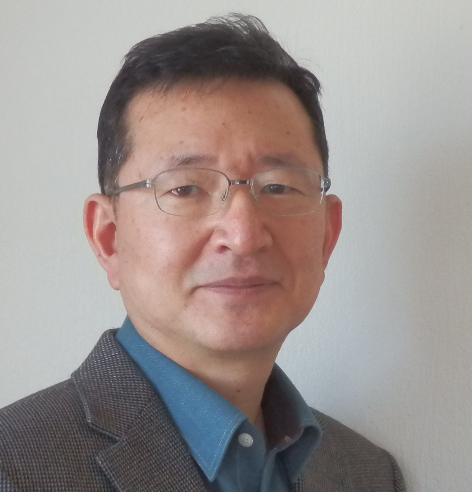

<html lang="en">

<head>
    <meta charset="UTF-8">
    <title>CV for Kyung Hwan Kim</title>
</head>

<body>

    <header>
        <h2>Kyung-Hwan Kim</h2>
    </header>
    

    <ul class="header">
         
        <li>Residence:Norway</li>
        <li>E-mail:k.kim.no@hotmail.com</li>
        <li>Mobile: +47 90 85 82 20</li>
        <li>Nationality: Korean</li>
        <li>Year of Birth: 1962</li>
    </ul>

    
QUALIFICATIONS

    <ul class="qualifications">
        <li>Self-driven professional with experiences in engineering, project, technical and commercial sales, and managerial position with good understanding of work</li>
        <li>process for marine / offshore industries.</li>
        <li>Project Managing / Technical Project Managing</li>
        <li>Ship design / engineering; Naval Architect </li>
        <li>Well understanding of global business culture and business process in marine sector</li>
        <li>Capability of statistical analysis and strategy development</li>
        <li>Good interpersonal/communication skill to work with all level of organization</li>
    </ul>

    
PROFESSIONAL EXPERIENCE

    
National Oilwell Varco

    

        

            2018.03.21 - 2019.12.31
             Project Manager
        

        

            <u>NOV Norway AS</u>
             Project managing for Coral FLNG, Offshore Cranes
             Clients: TechnipFMC in France, JGC in Japan and Samsung in Korea
             End User: ENI
        

    

    

        

            2014.02.01 – 2017.01.31 Technical Project Manager
        

        

            <u>NOV Norway AS</u>
             Technical project managing all NOV equipment (Drilling Machine, Drilling Fluid Process Equipment and Control system):  
            Project:-Jackup Rig, Maersk Invincible, delivered in Jan. 2017  
            -Drillship: Atwood
        

    

    
TTS Group ASA

    

        

            2011.11.01 – 2014.01.31 
            Project Manager, 
            Business Development 
        

        

            <u>TTS Business Unit Services (TTS Marine AS), Kristiansand</u>
             Service Hubs development 
            Market Analysis: Analyzing install base and estimating service business opportunity and turnover 
            A member of M&A working group 
            A member of Strategy Sourcing Group 
            HSE Manuals: Establishing safety manual and Check list for Job Safety Analysis 
            General Manager (Acting) of TTS Marine Inc in USA (2014. 04 – 2014. 12) 

        

    

    

        

            2009.01.01 – 2011.10.31 
            General Manager 
        

        

            <u>TTS Marine Korea</u>
             Business sector: Services for Marine/Offshore equipment 
            Sales support for new building 
            Establishing and setting up local service organization 
            Establishing Customer Relationship for services 
        

    

    

        

            1999.09.01 – 2008.12.31
        

        

            <u>TTS Marine Cranes AS, Bergen</u>
             Sales Manager for China (including Taiwan), Korea and Japan (2003.01-2008.12),
            Responsible for Commercial and Technical Sales
             Instructor for Sales training for Chinese employees in TTS Bohai, China (2016 May – Aug)
             Sales Engineer for Cranes (2002.02 - 2002.12)
             Project Engineer for Cranes (1999.09 - 2002.01)
        

    

    
Samsung Heavy Industries Co., Ltd. (Geoje Shipyard)

    

        

            1985.12.04 - 1999.04.30
        

        

            <u>Hull Outfitting Design Department</u>
            <ul>
                <li>Senior Ship Design Engineer, Section Chief of System Engineering</li>
                <ul>
                    <li>Apr. 1997: Drillship interface coordinator in Huston</li>
                    <li>May 1995: Coordinator at Bremer Vulkan shipyard in Germany</li>
                </ul>
            </ul>
            <ul>
                <li>Engineering Experience:
                    <ul>
                        <li>Ship Type: FPSO, LNG, Shuttle, Drillship, Tanker (Crude, Product and Chemical), Container, Ro-Ro</li>
                        <li>Equipment managing: Cargo Hatch Cover, Steering Gear, Cranes, Winch/Windlass, and Lifesaving Equipment<li> 
                        <li>Writer: Engineering manual for ship ventilation</li>
                        <li>Co-writer, Ship's machinery and equipment (Publish in 2000, The Society of Naval Architects of Korea) Chapter 5, Hull Piping System</li>
                        <li>Editorial supervision for Ship's machinery and equipment published by Korea Offshore & Shipbuilding Association
                    </ul>
                 </li>
            </ul>
        

    

    
OTHER EXPERIENCE

    <ul class="qualifications">
        <li>July 2017: Translator for Korean visitors at Flåm Harbour Authority</li>
        <li>March - July 2006: MecMar Exhaust Gas System, Documents Translation in Korean</li>
        <ul>
            <li>Operation Manual</li>
            <li>Service and Instruction Manual including Spare parts list</li>
        </ul>
        <li>1997-1998: Secretary of Hull outfitting design Subcommittee
            Engineering Committee, Korea Offshore & Shipbuilding Association</li>
    </ul>
    
EDUCATION

    <ul class="qualifications">
        <li>Nov. 2012: Project Management Professional, Korea Productivity Center, PMI member since 2012</li>
        <li>Nov. 2002: Norwegian language course (Module 1-3), Nygård Skole, Bergen, Norway</li>
        <li>Jul. 1992: Camp Trainning, Korean Standards Association</li>
        <li>May. 1989: Quality Management, Basic Practice, Korean Standards Association</li>
        <li>Feb. 1985: Bachelor, Naval Architecture, University of Ulsan, Korea</li>
    </ul>

    
SKILLS

    <ul class="qualifications">
        <li>Good at Microsoft Office; Word, Excel, Outlook, Power point, MS Project</li>
        <li>Language:</li>
        <ul>
            <li>Korean (Native)</li>
            <li>English (Fluent in spoken and written)</li>
            <li>Norwegian (Basic understanding in spoken and written):
                 Module 3, A language level to study texts for Norwegian culture and society</li>
        </ul>
    </ul>
</body>
</html>

